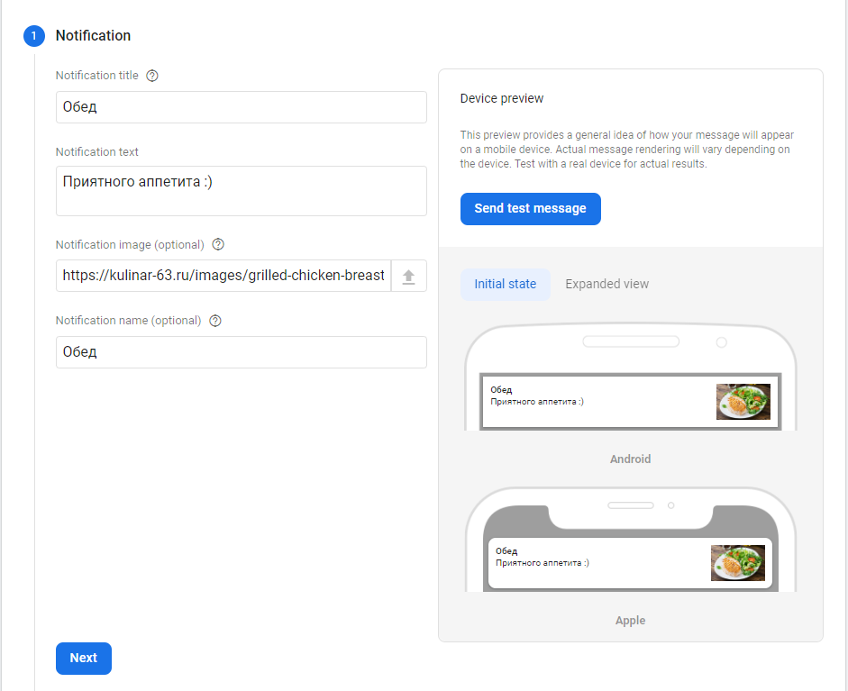
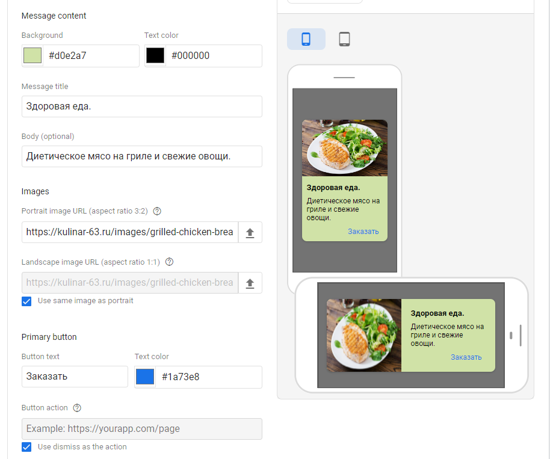

# Урок 4. A/B-тестирование мобильных приложений

## Задание 1.
Настроить а/б тест на мобильной версии (через google optimiza) сайта или взять любое из приложений с вашего телефона (соц. сети, каршеринг, игры, музыка, еда и т.д.) и придумать гипотетические 2-3 аб-теста:
-уведомления
-remote config
-in-app сообщения

***
**уведомления**

Гипотеза: \
Более агрессивное уведомление в обеденные часы будет иметь лучшую конверсию.

На каких пользователях тестируем: \
Пользователи приложения.

Метрики: 
* Процент конверсий в покупку
* Средний доход от пользователя

***
**in-app сообщения**

Гипотеза: \
Блюда из "здорового питания" повысят конверсию и привлекут новых клиентов.

На каких пользователях тестируем: \
Пользователи приложения.

Метрики: 
* Процент конверсий в покупку
* Средний доход от пользователя

